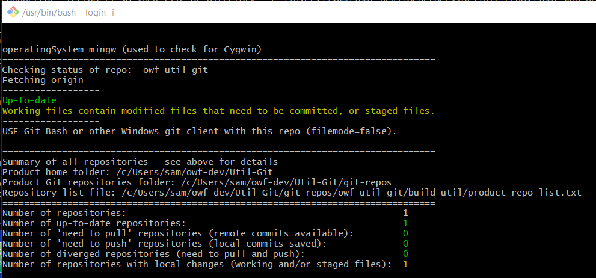

# owf-util-git #

This repository contains Open Water Foundation (OWF) Git utilities.
These are scripts that help use Git, intended to work in Linux, Cygwin, and Git Bash command line environments.
These utilities encapsulate Git commands that can be complex to use,
and help automate tasks when a product involves multiple Git repositories
and Git commands.
The scripts also check for configuration issues to help avoid errors.

*   [Background](#background)
*   [Repository Contents](#repository-contents)
*   [Utilities List](#utilities-list)
    +   [`git-backup.sh`](#git-backup-sh) - clone repositories to a backup folder
    +   [`git-check.sh`](#git-check-sh) - check status of product repositories
    +   [`git-clone-all.sh`](#git-clone-all-sh) - clone all repositories for a product
    +   [`git-difftool-kdiff3.sh`](#git-difftool-kdiff3-sh) - simplify use of DKiff3 on folders
    +   [`git-tag-all.sh`](#git-tag-all-sh) - tag all repositories for a product
*   [Installing Git Utilities](#installing-git-utilities)
    +   [Approach 1: Install Scripts in Main repository `build-util/git-util` Folder](#approach-1-install-scripts-in-main-repository-build-utilgit-util-folder)
    +   [Approach 2: Install as Clone of owf-git-util in Product Folder](#approach-2-install-as-clone-of-owf-git-util-in-product-folder)
    +   [Approach 3: Install as Clone of owf-git-util Repository in User Files](#approach-3-install-as-clone-of-owf-git-util-repository-in-user-files)
    +   [Approach 4: Install Scripts in User Account bin folder](#approach-4-install-scripts-in-user-account-bin-folder)
*   [License](#license)
*   [Contributing](#contributing)

-----

## Background ##

Despite its widespread adoption, Git is not a simple system.
The initial learning curve can be steep,
it is easy to forget commands, and there are many special situations
that require a deeper understanding of Git.
Periodic Git users may not be able to remember how to use Git.
In short, Git can be intimidating, which introduces a barrier to its adoption.

Using Git involves understanding its commands and protocols
as well as integrating a version-control system within the overall development environment
and workflow of a team.  Development environments are made more
complicated when dealing with different operating systems and development tools.
For example, handling end-of-line character and file permissions introduces challenges.

Various tools such as [Git for Windows](https://git-scm.com/),
text editors and integrated development environments (IDEs) with Git integration,
and Git hosting websites ([GitHub](https://github.com/),
[Bitbucket](https://bitbucket.org), [GitLab](https://about.gitlab.com/), etc.)
provide "easy to use" Git tools.
Nevertheless, Git can be intimidating and tools may actually make Git operations more opaque to understand.
Although Git should behave similarly across development environments,
there are always variations in how Git tools are accessed and behave.

This repository contains a number of command-line Git tools that have been developed
to help use Git in multiple operating systems,
in particular for projects that involve more than one repository, a single
developer or small team, and using a feature/topic branch off the master branch.
Scripts are particularly useful for the primary contributor/gate-keeper
that works directly with repositories.
Additional support for pull requests will be added.
The tools run in the following command line environments
and can augment other Git tools such as editors and IDEs:

*   Git bash
*   Cygwin
*   Linux

Installation of the tools is flexible,
with [several installation options described below](#installing-git-utilities).

## Repository Contents ##

The following folder structure is used for the repository:

```text
.gitattributes       Git repository configuration file.
.gitignore           Git configuration file for files to ignore.
build-util/          Folder for product-specific scripts installed
                     using a build-util/git-util approach,
                     using this repository as an example.
  git-check-util.sh  Product-specific script to check Git repository status,
                     calls git-util/git-check.sh.
  etc.
  git-util/          Folder containing general Git utility scripts.
    git-check.sh     General script for checking Git repository status.
    etc.

```

A recommended development environment folder structure is as follows,
but will of course vary by product and developer.
The Git utility scripts can work with any folder structure with specification of folders
via command arguments.  Scripts check for non-existence of folders and print warnings.

```
C:\User\user\        User files on Windows.
/home/user/          User files on Linux.
c/User/user/         User files on Git Bash.
/cygdrive/c/         User files in Cygwin.
   OrgOrSystem/      Folder for the organization or system,
                     to differentiate personal, company, client, systems.
     Product/        Folder for the product name.
       git-repos/    Folder for one or more Git repositories.
         git-repo1/  First Git repository for the product.
         git-repo2/  Second Git repository for the product.
         etc./
```

## Utilities List ##

The following are the utilities included in this repository,
which can be found in the `build-util/git-util` folder.
A short product-specific script is included in the `build-util` folder and
calls the general script in `build-util/git-util`.
The name of the product-specific script should usually add to the name of
the specific script to avoid confusion.
For example `build-util/git-check-util.sh` calls `build-util/git-util/git_check.sh`.

The utilities use a file
[`build-util/product-repo-list.txt`](build-util/product-repo-list.txt),
which contains a list of the repositories.
This file is expected to reside in the main product repository in the same folder as the
product-specific script, for example in `build-util` in this repository.

Why is the extension `.sh` used on scripts rather than no extension?
It can be confusing, especially on Windows, to know how a program should
be run and the extension provides a clue.
Implementers of the utilities can choose to remove the extension from the general script,
or omit the extension from the custom script.

Each script can be run with `-h` to print its usage.  Run with the `-v` option to check the version.

| **Utility Script**&nbsp;&nbsp;&nbsp;&nbsp;&nbsp;&nbsp;&nbsp;&nbsp;&nbsp;&nbsp;&nbsp;&nbsp;&nbsp;&nbsp;&nbsp;&nbsp;&nbsp;&nbsp;&nbsp;&nbsp;&nbsp;&nbsp;&nbsp;&nbsp;&nbsp;&nbsp;&nbsp;&nbsp;&nbsp;&nbsp;&nbsp;&nbsp; | **Description** |
|--------------------------|-----------------|
| `git-backup.sh`          | Use the `backup-repo-list.txt` file specified with `-l` option to clone repositories into a backup folder. |
|`git-check.sh`            | Check all the repositories in the `product-repo-list.txt` file and recommend whether to push, pull, etc.  Also helps avoid common issues like confusing Cygwin and Git Bash cloned-repos, which can cause end-of-line and file permission issues. |
| `git-clone-all.sh`       | Use the `product-repo-list.txt` file in the main repository to clone other needed repositories, useful when setting up a new development environment. |
| `git-difftool-kdiff3.sh` | Simplify use of KDiff3 to compare folders. |
| `git-tag-all.sh`         | Use the `product-repo-list.txt` file to tag all repositories for a product, useful when tagging milestone releases across multiple repositories. |

### `git-check.sh` ###

Check the status of all repositories for a product
and indicate which repositories need to be pushed, pulled, committed, etc.
The following example illustrates running the `git-check` utility for this repository.



#### `git-check.sh` Release Notes ####

| **Version** | **Description** |
| -- | -- |
| 1.9.3 (2023-03-26) | Fix logic where empty folder warning was always shown. |
| 1.9.2 (2022-09-22) | Handle main branch `main` in addition to `master`, indent output to improve grouping for a repository, improve handling of empty folders when gitignored. |

### `git-backup.sh` ###

This script will clone all repositories specified by the `-l backupRepoListFile` option,
with output to the folder specified by the `-o outputFolder` option.
This is useful as a step to backup repositories to media or a different system folder or cloud bucket.

### `git-clone-all.sh` ###

This script will clone all repositories for a product,
ignoring repositories that are already cloned.
The main repository will need to be cloned first so that the product list can be found.

### `git-difftool-kdiff3.sh` ###

Under development - trying to make it easy to use KDiff3 to compare versions/folders
for working files, master and other branches, etc.

### `git-tag-all.sh` ###

This script tags all the repositories in the product list.
The script prompts the user for tag name and commit message.

## Installing Git Utilities ##

The Git utilities provide useful features for basic tasks.
However, implementation of the utilities can vary by product and/or developer.
The following sections describe several options for implementing the utilities as well as
benefits and issues with each approach.

### Approach 1: Install Scripts in Main repository `build-util/git-util` Folder ###

The utility scripts can be copied to a `build-util/git-util` folder in the main
repository for a product.
The main benefits of this approach are that working scripts are versioned and will
not break if the utility scripts are updated by the script developers,
and the scripts can be customized as needed.
The downside to this approach is that the scripts have to be updated in each
product that they are implemented.
In practice, this approach is OK because the scripts only need to be updated
if they are not meeting needs, and manually copying allows testing the new copy.

To implement using this approach:

1.  Determine the product's main repository.
    This is typically the repository for the source code of the main program.
    Other repositories in a product may include tests, other software components,
    development environment tools, documentation,
    libraries, etc.
2.  In the main repository working files,
    create a `build-util` folder, if not already created.
3.  Under `build-util`, create a `git-util` folder.
4.  Copy desired general Git utility scripts from the `build-util/git-util` folder of
    this repository to the folder created in step 3.
    Gain access to the scripts by individually downloading files from the repository or clone
    the `owf-util-git` repository to a local folder and then copy the scripts.
    These scripts should not need to be modified.
    If changes are needed, alert the development team via GitHub repository issues.
    A simple way to download scripts may be added in the future.
5.  In the `build-util` folder created in step 2,
    create scripts that are specific to the product's main repository.
    These scripts will indicate folders to the general scripts.
    See examples in the `build-util` folder of this repository.
6.  Also in the `build-util` folder, create a file `product-repo-list.txt`
    containing the list of repository names for the product.
    See the [example `product-repo-list.txt` file in this repository](build-util/product-repo-list.txt).
    This file will be used to perform operations on multiple repositories that comprise a product.

The resulting folder structure will be similar that of this repository.

### Approach 2: Install as Clone of owf-git-util in Product Folder ###

Another approach to installing the utilities is to clone the `owf-git-util`
repository similar to other repositories that comprise the product.
In this case, the general scripts would need to be called
with a wrapper script similar to Approach 1, but the path to the generalized
script would be to the location of the generalized script in the cloned repository.

The benefit of this approach is that updates to the utilities scripts would occur by pulling the repo.
The downside is that changes in the utility scripts when pulled could break operational development environments.
It may also complicate a product's development environment by having a repository that is not a part of the product, for example whether to list in `product-repo-list.txt`.
Also, because the utility scripts will not be tracked in the product repository,
changes over time will likely break for a specific product version.

### Approach 3: Install as Clone of owf-git-util Repository in User Files ###

This approach is similar to Approach 2 except that the repository is cloned
to a location in the user's files separate from the product repositories.
This approach may be used in any case to gain access to a local copy of the scripts.
For example, clone the repository to a location under the user files and then
copy specific scripts in the main product repository that call the general scripts
as per Approach 1.

A major issue to this approach is that scripts in a product repository will
reference a repository folder that may not be consistent amount developers.

An issue with this approach is that each repository that uses the utilities must
assume that they have been installed in this way,
Also, because the utility scripts will not be tracked in the product repository,
changes over time will likely break for a specific product version.

### Approach 4: Install Scripts in User Account bin folder ###

This approach involves copying the utility scripts to a `bin` folder that is in
the User's account `PATH`.
This allows the scripts to be called from any location.
The `owf-util-git` repository should be cloned to a location and scripts complicated
into the user's `bin` folder.

The benefit to this approach is that the scripts will be accessible to all products and repositories.
An issue with this approach is that each repository that uses the utilities must
assume that they have been installed in this way.
Also, because the utility scripts will not be tracked in the product repository,
changes over time will likely break for a specific product version.

Specifics to this approach are listed below.

#### Cygwin ####

It is assumed that repositories will be cloned in the Windows user files (`/cygdrive/C/Users`),
rather than Cygwin user files (`/home`).
Add something like the following to the `$HOME/.bash_profile` to enable finding scripts in the repository `bin` folder.
The `$USERNAME` Windows environment variable is recognized by Cygwin and indicates the user's login name (and home folder).
The folder used to clone the repository is a user preference.
If editing from Windows rather than command line, the file is typically located under `C:\Users\username`.

``` text
# Set PATH so it includes the Git utilities
if [ -d "/cygdrive/C/Users/$USERNAME/owf-dev/Util-Git/git-repos/owf-util-git/bin" ] ; then
  PATH="/cygdrive/C/Users/$USERNAME/owf-dev/Util-Git/git-repos/owf-util-git/bin:${PATH}"
fi

```

#### Git Bash ####

Add something like the following to the `$HOME/.bash_profile` to enable finding scripts in the repository `bin` folder.
The `$HOME` Windows environment variable is recognized by Git Bash and indicates the user's login name (and home folder).
The folder used to clone the repository is a user preference.
If editing from Windows rather than Bash command line, the file is typically located under `C:\Users\username`.

``` text
# Set PATH so it includes the Git utilities
if [ -d "$HOME/owf-dev/Util-Git/git-repos/owf-util-git/bin" ] ; then
  PATH="$HOME/owf-dev/Util-Git/git-repos/owf-util-git/bin:${PATH}"
fi

```

#### Linux ####

Add something like the following to the `$HOME/.bash_profile` to enable finding scripts in the repository `bin` folder.
The `$HOME` Windows environment variable is recognized by Git Bash and indicates the user's login name (and home folder).
The folder used to clone the repository is a user preference.

``` text
# Set PATH so it includes the Git utilities
if [ -d "$HOME/owf-dev/Util-Git/git-repos/owf-util-git/bin" ] ; then
  PATH="$HOME/owf-dev/Util-Git/git-repos/owf-util-git/bin:${PATH}"
fi

```

## License ##

The OWF Git Utilities are licensed under the GPL v3+ license.
See the [GPL v3 license text](LICENSE.md).

Because the utilities will be used by developers of a product,
this mainly means that developers need to have access to the scripts,
which will be the case anyhow.

## Contributing ##

These Git utilities have been developed by the Open Water Foundation to
help its staff and collaborators be effective and efficient with Git and GitHub.
Feedback and contributions are welcome.  We will try to incorporate.
